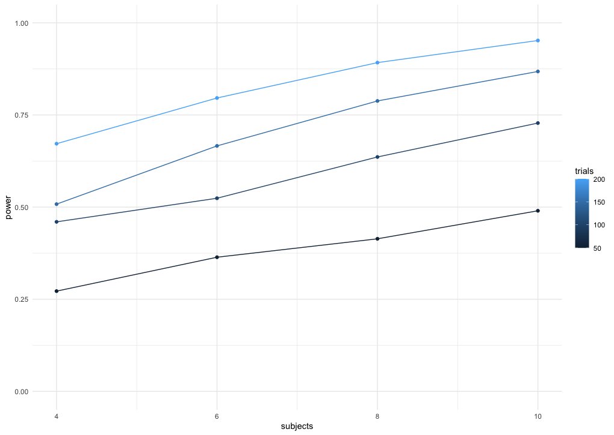

```{r setup, include=FALSE}
knitr::opts_chunk$set(echo = TRUE)
```

## load the libraries that we will be using ## 

## install ##

```{r install-pkg}
# install.packages(c("tidyverse", "RColorBrewer", "patchwork"))
```

take a snapshot of loaded packages and update the lock.file using renv

```{r snapshot-renv}
# take a snapshot and update the lock.file
# renv::snapshot() # this is only necessary when new packages or installed or packages are updated.
```

## load ##

```{r load-pkg}
pkg <- c("tidyverse", "RColorBrewer", "patchwork")

lapply(pkg, library, character.only = TRUE)
```

```{r initialize, include=F}
library(tidyverse)
library(lme4)
library(nlme)
#library(bookdown) # for automatic Figure numbering
theme_set(theme_minimal())
set.seed(4567)
```

# Background

In psychological experiments, the analysis of response time (RT) and accuracy data is typically done using ANOVA on the means of each subject-condition combination. This approach has a number of disadvantages ([Panis, Schmidt, Wolkersdorfer, & Panis, 2020](https://journals.sagepub.com/doi/full/10.1177/2041669520978673)). For example, when the mean RT is different between two experimental conditions, one still does not know whether the onset time of the fastest responses is different or not between the two conditions, nor when the experimental effect exactly emerges in time, how long it lasts, and when it peaks. Such extra knowledge is necessary to better constrain theoretical interpretations of the underlying cognitive processes ([Panis & Schmidt, 2022](https://www.degruyter.com/document/doi/10.1515/psych-2022-0005/html)). Panis et al. (2020) propose to use Event History Analysis - a.k.a. survival, hazard, duration, transition, failure-time analysis -, the standard set of techniques to analyse time-to-event data ([Singer & Willett, 2003](https://psycnet.apa.org/record/2003-00630-000)). In particular, they propose to use *discrete-time* EHA, because the number of trials per subject-condition combination is typically not that large, and parametric approaches are too restrictive. The stretch of time in each trial between time point 0 (typically target onset time) and the follow-up time (e.g., the response deadline time point) is divided in contiguous bins (startpoint excluded; endpoint included), and the shape of the empirical RT distribution is described by plotting the diagnostic discrete-time hazard function h(t) = Prob(T = t | T $\ge$ t) - the conditional probability that the event-of-interest occurs in bin t given that is does not occur before bin t -, which is easily estimated for empirical data by setting up a life table.

# Simulation goal

Our goal here is to simulate data from a small-N design, to estimate the power to detect a certain effect size (hazard-ratio) in a certain time bin, as a function of the number of trials (K) per subject-condition combination, and the number of subjects (N). 
For simplicity, we start with a within-subjects design with two conditions. Assume that the hazard function in condition 1 starts to rise around 200 ms after target onset, reaches a peak of about .5 around 600 ms after target onset, and then levels off to a constant non-zero value of about .40 (this shape is often observed in empirical data).

### Step 1. Set up and plot a user-defined discrete-time hazard function.

```{r step1, fig.cap = "Figure 1. A user-defined discrete-time hazard function."}
followup <- 1000 # length of data collection period in ms for each trial
nr_bins  <- 20
bin_width <- followup/nr_bins
bin_endpoints <- (1:nr_bins)*bin_width

hazard_cond1 <- c(0, 0, 0, 0, 0.03, 0.08, 0.11, 0.19, 0.31, 0.42, 0.50, 0.52, 0.47, 0.43, 0.40, 0.41, 0.39, 0.41, 0.40, 0.39)

data_h <- tibble(hazard = hazard_cond1, time = bin_endpoints)
ggplot(data_h, aes(x = time, y = hazard)) +
  geom_line() + geom_point() +
  scale_x_continuous(breaks = bin_endpoints) +
  scale_y_continuous(limits = c(0,1)) +
  xlab("endpoints of discrete time bins (ms)") +
  ylab("discrete-time hazard probability")

```

### Step 2. Create a function to simulate discrete time-to-event data for one trial from this user-specified discrete-time hazard function.

```{r step2}
sim_haz <- function(hazF){
  n = length(hazF)
  bin_counter = 0
  event_occured = F
  data <- c()
  while(bin_counter < n & event_occured == F){
   bin_counter <- bin_counter + 1  
   flip <- runif(1,0,1) # draw a random number from [0,1] 
   if(flip > hazF[bin_counter]){
     data[bin_counter] <- 0
   } else {
     data[bin_counter] <- 1
     event_occured <- T
   }
  }
  return(data.frame(time = c(1:bin_counter), outcome = data)) 
}
```

Let's test this function for two trials.

```{r testFunction1}
# simulate data from 2 trials
for(i in c(1:2)){test <- sim_haz(hazard_cond1);print(test)}
```

### Step 3. Introduce an assumed effect size (hazard ratio) for each time bin. 

```{r plot2haz, fig.cap = "Figure 2. A user-defined effect of an experimental manipulation on the shape of the hazard function (between 450 and 650 ms after target onset), with some jitter added."}
# d sets effect size (hazard ratio) for each bin:
d <- c(1,1,1,1,1,1,1,1,1,  1.1,    1.2,    1.1,  1.1,  1,  1,1,1,1,1,1)
hazard_cond2 <- hazard_cond1*d

# add some jitter to the hazard functions, and set negative values to 0 
          hazard_cond1_J <- c()
          hazard_cond2_J <- c()
          for(i in 1:length(hazard_cond1)){
            hazard_cond1_J[i] <- hazard_cond1[i] + rnorm(1,0,.01)
            hazard_cond2_J[i] <- hazard_cond2[i] + rnorm(1,0,.01)
            if(hazard_cond1_J[i] < 0){
               hazard_cond1_J[i] <- 0
            }
            if(hazard_cond2_J[i] < 0){
               hazard_cond2_J[i] <- 0
            }
          }

# plot both hazard functions
data_h2 <- tibble(hazard1 = hazard_cond1_J, hazard2 = hazard_cond2_J, time = bin_endpoints)
p2 <-ggplot(data_h2, aes(x = time)) +
  geom_line(aes(y = hazard1, color = "black")) + 
  geom_point(aes(y = hazard1, color = "black")) +
  geom_line(aes(y=hazard2, colour = "red")) +
  geom_point(aes(y = hazard2, color = "red")) +
  scale_color_identity(name = 'Condition',
                       breaks = c('black', 'red'),
                       labels = c("1", "2"),
                       guide = 'legend') +
  scale_x_continuous(breaks = bin_endpoints) +
  scale_y_continuous(limits = c(0,1)) +
  xlab("endpoints of discrete time bins (ms)") +
  ylab("discrete-time hazard probability") 
p2
```

### Step 4. Create a function to run a generalized linear mixed effects regression model on a simulated subject-trial-bin data file with K trials per condition, and N subjects.

```{r sim}
# ntrials to change number of trials
#    nsub to change number of subjects
sim_power <- function(hazF1,d,ntrials,nsub){
    hazF2 <- hazF1*d  
    data <- data.frame()
    for(subj in 1:nsub){

      # add some jitter to the hazard functions for each subject, and set negative values to 0 
          hazF1_J <- c()
          hazF2_J <- c()
          for(i in 1:length(hazF1)){
            hazF1_J[i] <- hazF1[i] + rnorm(1,0,.01)
            hazF2_J[i] <- hazF2[i] + rnorm(1,0,.01)
            if(hazF1_J[i] < 0){
               hazF1_J[i] <- 0
            }
            if(hazF2_J[i] < 0){
               hazF2_J[i] <- 0
            }
          }
      for(cond in 1:2){
        for(tr in 1:ntrials){
          if(cond==1){
                data_temp <- data.frame(subject = subj, condition = cond, trial = tr, sim_haz(hazF1_J)) # simulate ntrials for condition 1
          } else {
                data_temp <- data.frame(subject = subj, condition = cond, trial = tr, sim_haz(hazF2_J)) # simulate ntrials for condition 2
          }
          data <- rbind(data, data_temp)
        }
      }
    }
    # preprocessing before fitting glmer
    
    # delete first 4 time bins 
    data <- subset(data, data$time>4)  
 
    # include centered version of linear time to select bin of interest (bin 11 with hazard ratio of 1.2)
    data$time1 <- data$time-11  
    
    # add nonlinear effects of time
    data$time2 <- data$time1^2
    data$time3 <- data$time1^3

    # center trial variable on trial 10
    data$trialC <- data$trial-10 

    # change range of trialC to solve convergence problems
    data$trialC2 <- data$trialC/100

    # recode condition into dichotomous variables
    data$cond  <- ifelse(data$condition==2,1,0)
    
    # convert some colums into factors
    data$subject  <- factor(data$subject)
    data$cond     <- factor(data$cond)
    data$outcome  <- factor(data$outcome)

    # fit glmer model
    fit1<-glmer(outcome ~ 1+time1+time2+time3+ # baseline hazard function for condition 1

              # main effects & interactions with time
              trialC2 + trialC2:time1 + trialC2:time2 + 
              cond    + cond:time1    + cond:time2    + cond:time3 +

              # random effects, control parameters, data set, and complementary log-log link function
              (1+time1|subject),  data=data, family=binomial(link="cloglog"))

    # print(summary(fit1))
    
    # return the pvalue for effect "cond1"
    return(coef(summary(fit1))[6,4])
}
```

Let's test the function.

```{r testsim}
test2 <- sim_power(hazard_cond1,d,10,2)
test2
```

The message "boundary (singular) fit: see help('isSingular')" refers to the fact that the estimated correlation between the random effects Intercept and TIME equals -1, because the simulated data from each subject is based on the same hazard function (despite some jitter on the hazard probabilities for each subject). Future simulations can introduce variation in the intercept and slope of the hazard functions across subjects.

### Step 5. Estimate power by running 500 simulations for each of 16 K-N combinations, to detect a hazard ratio of 1.2 in bin 11, using a generalized linear mixed effects regression model.

```{r power, eval=F}
# vectors for number of subjects and trials
n_subs_vector   <- c(4, 6, 8, 10)
n_trials_vector <- c(50, 100, 150, 200)

# a loop to run all simulations
power <- c()
subjects <- c()
trials <- c()
i <- 0 # use this as a counter for indexing

for(s in n_subs_vector){
  for(t in n_trials_vector){
    i <- i+1
    sims <- replicate(500,sim_power(hazard_cond1,d,t,s))
    power[i] <- length(sims[sims<.05])/length(sims)
    subjects[i] <- s
    trials[i] <- t
    print(i)
  }
}

# combine into dataframe
plot_df <- data.frame(power,subjects,trials)

# plot the power curve
ggplot(plot_df, aes(x=subjects,
                    y=power,
                    group=trials,
                    color=trials))+
  geom_point()+
  geom_line()+
  scale_y_continuous(limits=c(0,1))+
  scale_x_continuous(breaks=n_subs_vector)


```

As shown in Figure 3, we need at least 8 subjects and 200 trials per condition to detect a hazard ratio of 1.2 in bin (500,550] with a power of at least 80%.

```{r fig3, echo=F, fig.cap="Figure 3. Simulated power for each combination of #subjects and #trials-per-condition. Each point is based on 500 simulations."}

```

### Step 6. Repeat steps 4 and 5, but for a Bayesian glmer model. 

Work in progress...
